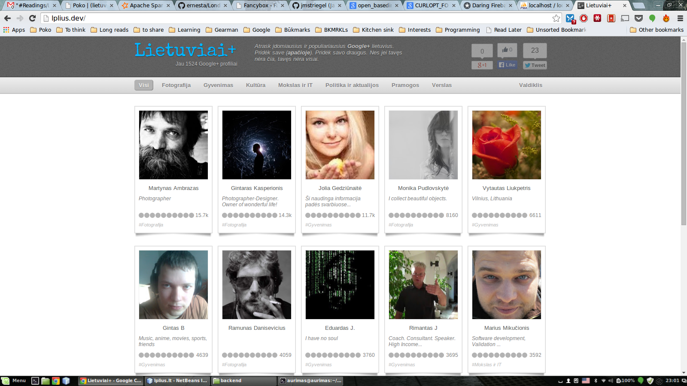
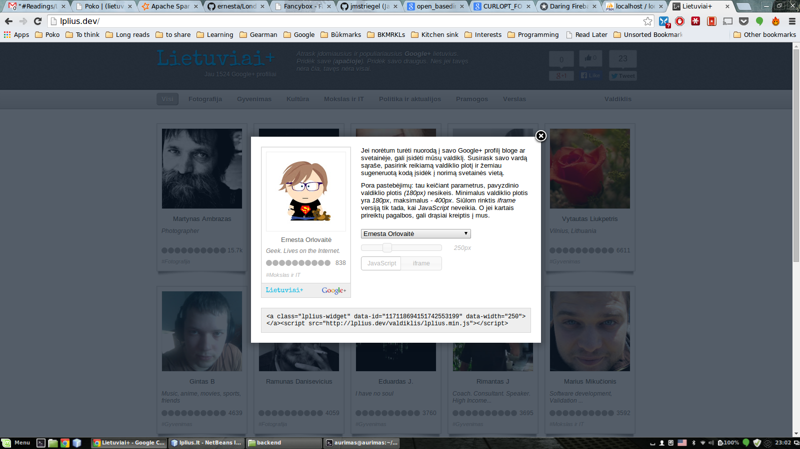
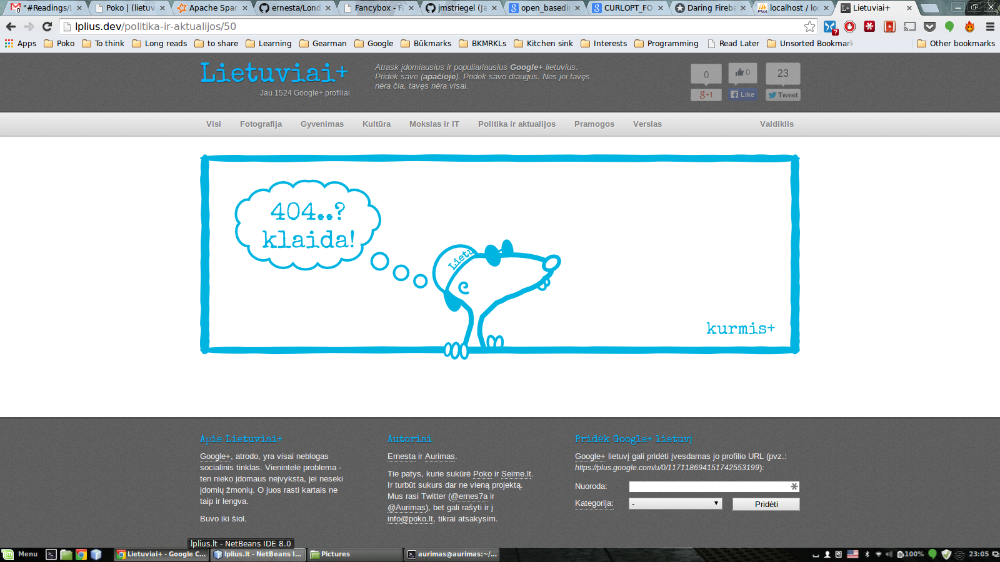

# [Lietuviai+](http://lplius.ernes7a.lt)

Once upon a time Google launched its social network. The accounts on what happened next may vary, 
but the truth is that some people used it heavily, even making it the main social network to spend time in.
As with any social network, status on Google+ is important, and is primarily determined by your follower count.

So when the social network started picking up in Lithuania, we wondered - wouldn't it be cool to have a website 
where one could see the most influential users on Google+? We found how to use an unofficial Google+ API for that and that's
how this project took off. We even made a it possible to have a widget to show off your follower count on your blog or website!

## Code

A bit of [Bootstrap](http://twitter.github.io/bootstrap/), [jQuery UI](http://wwwjqueryui..com/) and [FancyBox](http://fancybox.net/).
On the backend site, we would not have lived without [the library for interacting with Google+ API ](https://github.com/jmstriegel/php.googleplusapi) by [Jason Striegel](https://github.com/jmstriegel).

## Usage notes

+ You need to provide your database credentials and some other information in settings/settings.ini. A sample settings file is provided under the same folder.
+ To setup the required MySQL tables, run ['install.php'](backend/install.php) script.
+ The ['followers-cron.php'](backend/followers-cron.php) script is designed to batch update your users' followers counts. Note that it needs to be run with "open_basedir=''" as it uses *CURLOPT_FOLLOWLOCATION* internally.

## Authors
**Ernesta Orlovaitė**

+ [ernes7a.lt](http://ernes7a.lt)
+ [@ernes7a](http://twitter.com/ernes7a)

**Aurimas Račas**

+ [aurimas.eu](http://aurimas.eu)
+ [@Aurimas](http://twitter.com/aurimas)

## Screenshots

 